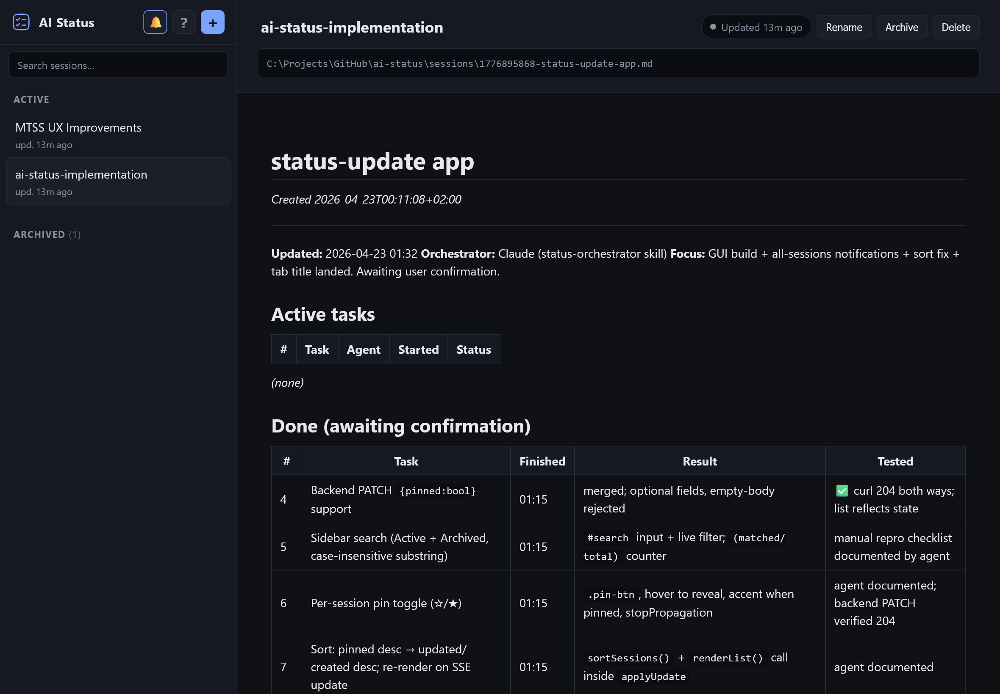

# AI Status

Local web dashboard for Claude Code (or any agent) to report progress while it works. The agent writes Markdown to a session file; this app watches the file and renders it live in your browser.

Pairs with the bundled **status-orchestrator** skill, which turns Claude into an orchestrator: it maintains the status file, delegates work to background subagents, and holds them to a quality bar.



## What it does

- Runs a small Go server on `http://127.0.0.1:7879`.
- Manages a list of sessions (create, rename, pin, archive, search).
- Each session = one `.md` file on disk under `./sessions/`.
- Click a session title in the sidebar to copy its absolute path — paste that into Claude so it knows where to write.
- Page re-renders live (SSE) every time the file changes.
- Optional desktop notifications when a session changes while the tab is hidden.
- System-tray icon with Open / Copy URL / Quit. Single-instance — re-launching the exe reuses the running server and pops a fresh browser tab.

## Features

### Embedded terminals per session

Open a Claude (or any) console directly inside the session's column — no Alt-Tab, no lost context:

- ConPTY-backed on Windows, `creack/pty`-backed on Linux & macOS; full key passthrough (Esc, Ctrl+B, etc.) so Claude Code's shortcuts work.
- Terminal survives tab switches — the PTY lives on the server. `× Close` kills it explicitly; nothing else does.
- `▶ Show cmd` reattaches to a running PTY, or resumes via `claude --resume <uuid>` when the session has a stored Claude session ID, or starts fresh otherwise.
- `Open cmd` launches a detached console in the session's working folder — same resume/fresh logic. Windows uses `cmd.exe`; Linux probes for `gnome-terminal`, `konsole`, `xfce4-terminal`, `xterm`, etc. (or honours `$TERMINAL`); macOS drives Terminal.app via AppleScript.
- Ctrl+C copies selected text; Ctrl+V pastes. Ctrl+C with no selection forwards the SIGINT as usual.

### Live diff highlighting

Every time the file is re-saved, blocks whose plain text appeared since the last version get an amber highlight in the rendered markdown — including table rows. The mark persists until the *next* update, so you never miss what changed while you were away.

### Skill that loads itself

The `status-orchestrator` skill is embedded in the binary and written to `data/status-orchestrator.SKILL.md` on startup. When you `▶ Start cmd` for a fresh session, the terminal runs:

```
claude "Read and follow <path-to-SKILL.md>, then use this for status: <path-to-session.md>"
```

So Claude adopts the orchestrator role immediately — no skill install required. (If you already installed the `.skill` zip from the help dialog, that's fine too; they're the same content.)

### Themes

Dark is the default. A sidebar-footer button cycles **System → Light → Dark**; the choice is stored as a `theme` cookie (1 year) and applied pre-paint (no flash on reload).

### Mobile drawer

Below 768px the sidebar collapses to an off-canvas drawer — tap the hamburger top-left to open. Tap the overlay or press Escape to close; selecting a session also closes it.

### YAML frontmatter metadata

Sessions store their metadata (`title`, `project_folder`, `claude_session`, `created`, `focus`) as YAML front matter at the top of the `.md` file. It renders invisibly in the dashboard (via `goldmark-meta`) but stays machine-readable. The header shows `focus` as a sub-title; the **Metadata** button toggles a panel with all fields.

### Other conveniences

- **Native folder picker** — Windows uses the real `FolderBrowserDialog`; Linux uses `zenity` / `kdialog` / `yad` (first one found); macOS uses an AppleScript `choose folder` prompt. Beats the sandboxed `webkitdirectory` which only exposes the folder name.
- **Open file** — opens the raw `.md` in your system's default editor (`start` on Windows, `xdg-open` on Linux, `open` on macOS).
- **Renaming the title** rewrites the YAML `title:` field in place and keeps the sidebar / browser tab in sync.
- **Auto-reload** — when the server restarts, the connection banner appears briefly; once the SSE stream reconnects, the tab reloads itself so you pick up new assets automatically.
- **Relative timestamps** in coarse buckets ("just now", "a moment ago", "X minutes ago", "an hour ago", …) so nothing ticks every second.

## Requirements

- Windows 10 / 11, or Ubuntu 22.04+ / any modern Linux desktop, or macOS 12+
- Go 1.22+ (only to build from source)

### Linux runtime extras

- **Terminal emulator** (any of): `gnome-terminal`, `konsole`, `xfce4-terminal`, `mate-terminal`, `tilix`, `alacritty`, `kitty`, `terminator`, `xterm`. The app auto-detects; set `$TERMINAL` to force one. Already installed on stock Ubuntu Desktop.
- **Folder picker**: `zenity` (GNOME), `kdialog` (KDE), or `yad`. `sudo apt install zenity` on Ubuntu.
- **Default-handler opener**: `xdg-utils` (`xdg-open`). Already installed on Ubuntu Desktop.

### Linux build extras

`libgtk-3-dev` and `libayatana-appindicator3-dev` are required to build the system-tray integration:

```
sudo apt install build-essential libgtk-3-dev libayatana-appindicator3-dev pkg-config
```

## Install

Download the prebuilt binary for your OS from the [GitHub Releases](https://github.com/jwillmer/ai-status/releases) page, or build from source.

### One-shot dependency install (Linux & macOS)

```
./scripts/install-deps.sh           # interactive: asks before sudo
./scripts/install-deps.sh --yes     # non-interactive
```

Detects `apt` / `dnf` / `pacman` / `zypper` (Linux) or `brew` (macOS), checks each dep with `pkg-config` / `command -v`, and installs only what's missing. Idempotent — safe to re-run.

### Build

**Windows:**

```
go build -ldflags="-H windowsgui" -o ai-status.exe
```

The `-H windowsgui` flag hides the console window. Omit it while developing if you want stdout.

**Linux / macOS:**

```
./scripts/build.sh           # kill running instance, build, relaunch detached, verify
./scripts/build.sh -b        # build only
./scripts/build.sh -n        # kill + build, don't relaunch
```

Or directly: `go build -o ai-status .`

## Run

**Windows:** `ai-status.exe`  
**Linux / macOS:** `./ai-status` (or `./scripts/build.sh` to rebuild and relaunch in one step)

Opens the browser automatically and adds a tray icon. Sessions and app data are written under the working directory (`./sessions/`, `./data/`).

### Flags

| Flag | Default | Purpose |
|---|---|---|
| `-addr` | `127.0.0.1:7879` | Listen address |
| `-root` | `.` | Data root (holds `sessions/`, `data/`, log) |
| `-no-tray` | `false` | Run without system-tray icon |
| `-no-open` | `false` | Don't auto-open the browser |

## Companion skill

The `status-orchestrator` skill is bundled at `skill/status-orchestrator/SKILL.md` and exposed as a `.skill` download from the app (and from GitHub).

Install in Claude: **Customize → Skills → Install skill**, select the downloaded `.skill` file.

Source: [`skill/status-orchestrator/SKILL.md`](skill/status-orchestrator/SKILL.md)

## Usage

1. Launch `ai-status` (or `ai-status.exe` on Windows). The dashboard opens at `http://127.0.0.1:7879`.
2. Click **New session** — a fresh `.md` file is created under `sessions/`.
3. Click the session title to copy its absolute path.
4. In Claude, paste the path and ask it to use it (the skill recognises the pattern automatically).
5. Work as normal. Claude writes status; the page updates live.

## Data layout

```
<root>/
├── sessions/          # one .md per session
├── data/
│   └── sessions.json  # session metadata (titles, pin, archive state)
└── status-updates.log # server log (only visible in windowsgui builds)
```

All files are plain text. Safe to back up, diff, or edit by hand.

## License

MIT
