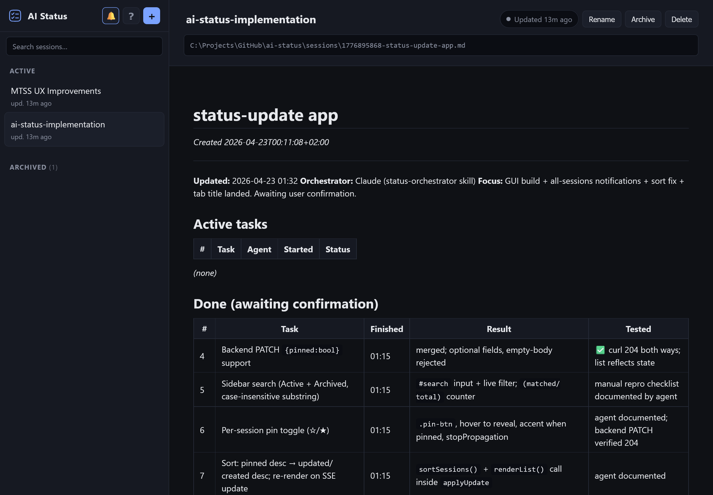

# AI Status

A local web dashboard where Claude Code (or any agent) reports its progress while it works. The agent writes Markdown to a session file; this app watches the file and renders it live in your browser — so you always know what your agent is doing, without babysitting the terminal.

## Why you'd want it

- **See progress at a glance.** Each session is a Markdown file that re-renders live (SSE) every time the agent touches it, with changed blocks highlighted in amber.
- **Run the agent right there.** Open a Claude console inside each session's column — terminals live on the server and survive tab switches.
- **No setup for the agent.** The bundled **status-orchestrator** skill is embedded in the app and loaded automatically, so Claude maintains the status file and delegates work without you installing anything.
- **Stays out of the way.** System-tray icon, single instance, dark/light themes, desktop notifications, mobile drawer.

→ Full feature tour: **[docs/features.md](docs/features.md)**

## Install & run

1. **Get it.** Download the prebuilt binary for your OS from [Releases](https://github.com/jwillmer/ai-status/releases), or build from source:
   - Windows: `go build -ldflags="-H windowsgui" -o ai-status.exe`
   - Linux / macOS: `./scripts/build.sh` (or `go build -o ai-status .`)
2. **Run it.** `ai-status.exe` (Windows) or `./ai-status` (Linux / macOS). It opens the dashboard at `http://127.0.0.1:7879` and adds a tray icon.
3. **Find it later.** On Windows it auto-registers on first run, so "AI Status" shows up in the Start menu and Settings → Installed apps. On Linux run `./scripts/install-desktop.sh` for an app-menu entry.

→ Full install details, runtime flags, and OS-specific notes: **[docs/install.md](docs/install.md)**

## Use it

1. Click **New session** — a fresh `.md` is created under `sessions/`.
2. Click the session title to copy its absolute path.
3. Paste that path into Claude and ask it to use it — the skill picks it up automatically.
4. Work as normal. Claude writes status; the page updates live.

→ Usage, the companion skill, and data layout: **[docs/usage.md](docs/usage.md)**

## License

MIT
